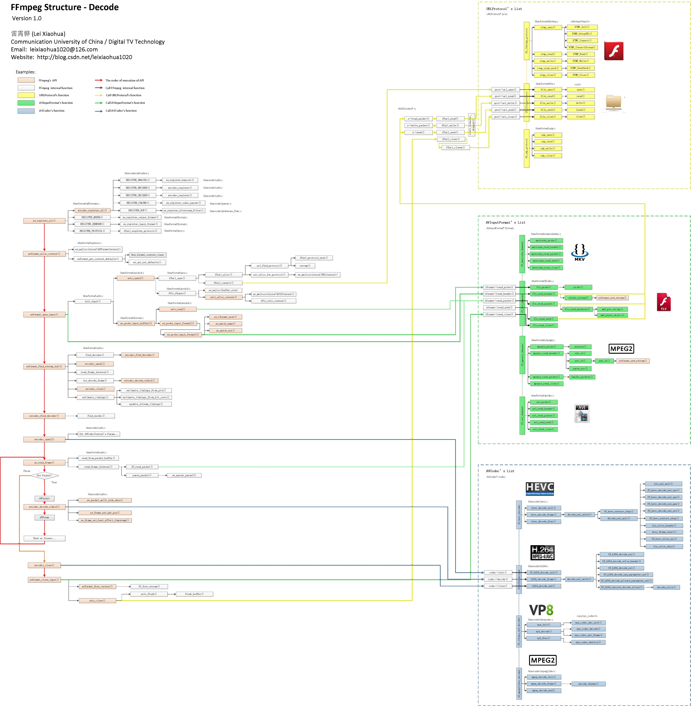

# FFmpeg-iOS from 0 to 0.1
> 本文测试时Mac 10.14.1 (18B75), XCode 10.1 (10B61), Swift 4.2, FFmpeg 4.0.3, 使用测试视频 flv, mp4格式

> status: decode video to yuv data  
> next: render yuv to screen

  
image get from here 
[iOSデバイス一覧表](https://qiita.com/takkyun/items/814aa45beee422a5f0c6)
so support arm64 just enough

## Goals
1. tag 0.0.1 complete video decoder, read file to yuv data

## lame download and build
[LAME (Lame Aint an MP3 Encoder) -  Browse /lame at SourceForge.net](https://sourceforge.net/projects/lame/files/lame/)
now version 3.100

``` shell
./configure	\
--disable-shared	\
--disable-frontend	\
--host=arm-apple-darwin	\
--prefix="/Users/chaostong/Downloads/lame-3.100/thin/arm64"	\
CC="xcrun -sdk iphoneos clang -arch arm64"	\
CFLAGS="-arch arm64 -fembed-bitcode -miphoneos-version-min=10.0"	\
LDFLAGS="-arch arm64 -fembed-bitcode -miphoneos-version-min=10.0"
make clean
make -j8
make install
# ./configure	\
# --disable-shared	\
# --disable-frontend	\
# --host=arm-apple-darwin	\
# --prefix="/Users/chaostong/Downloads/lame-3.100/thin/arm64e"	\
# CC="xcrun -sdk iphoneos clang -arch arm64e"	\
# CFLAGS="-arch arm64e -fembed-bitcode -miphoneos-version-min=10.0"	\
# LDFLAGS="-arch arm64e -fembed-bitcode -miphoneos-version-min=10.0"
# make clean
# make -j8
# make install
# combine then arm64 arm64e好似没啥区别 so
# lipo -create ./thin/arm64/lib/libmp3lame.a ./thin/arm64e/lib/libmp3lame.a -output libmp3lame.a

```

## FFmpeg-iOS 编译
编译脚本
[GitHub - kewlbear/FFmpeg-iOS-build-script: Shell scripts to build FFmpeg for iOS and tvOS](https://github.com/kewlbear/FFmpeg-iOS-build-script)

编译完成后添加进入工程还需要 添加
	1. libz.1.1.3.tbd
	2. libbz2.tbd
	3. libiconv.2.4.0.tbd
	4. CoreMedia.framework
	5. VideoToolbox.framework
	6. AudioToolbox.framework

and set header search path

use in swift you need set a bridge contains
``` objectivec
#include "libavformat/avformat.h"
#include "libswscale/swscale.h"
#include "libswresample/swresample.h"
#include "libavutil/pixdesc.h"
```

after this, FFmpeg-iOS的开发环境就算搭建好了


# 使用FFmpeg读取媒体文件
> FFmpeg api 源码解读 [FFmpeg源码解读](https://blog.csdn.net/leixiaohua1020/article/details/44220151)


1. 引用头文件
2. 注册协议 封装格式 编解码器
	1. 本地文件、网络文件
	2. AVFormatContext：统领全局的基本结构体。主要用于处理封装格式（FLV/MKV/RMVB）
	3. 编码格式
3. 打开媒体文件源 设置超时回调
4. 寻找各个流 并且打开对应的解码器
5. 初始化解码后数据的结构体
6. 读取流内容并且解码
7. 处理解码后的裸数据
8. 关闭所有资源

## 通用API分析
1. av_register_all
	1. 注册所有的编解码器, 目前deprecated, 但是并没有找到替代函数
2. avcodec_find_decoder
	1. 查找编码器, though AVCodecID, 音视频流里有这个信息 codec_id
3. avcodec_open2
	1. 初始化一个音视频编解码器的AVCodecContext
	2. codec deprecated to codecpar, 并不是不用了, 而是多抽象出一个对象, 不推荐直接使用stream.codec 而是 stream.codecpar, codecCtx 使用 avcodec_alloc_context3 创建
4. avcodec_close
	1. 关闭编码器

## 解码时用到的函数分析
1. avformat_open_input
	1. 打开多媒体数据方法, 成功返回非 0
2. avformat_find_stream_info
	1. 从文件中获取流信息
	2. 该函数主要用于给每个媒体流（音频/视频）的AVStream结构体赋值. 已经实现了解码器的查找，解码器的打开，视音频帧的读取，视音频帧的解码等工作。换句话说，该函数实际上已经“走通”的解码的整个流程
3. av_read_frame
	1. 读取码流中的 音频若干 帧 或者 视频 一帧
4. avcodec_decode
	1. 解码一帧视频数据
	2. 输入一个压缩编码的结构体AVPacket，输出一个解码后的结构体AVFrame
5. avformat_close_input
	1. 关闭一个AVFormatContext，一般情况下是和avformat_open_input()成对使用的

## 编码时用到的函数分析

1. avformat_alloc_input_context2
2. avio_open2


本作品采用 [知识共享署名-非商业性使用-禁止演绎 3.0 未本地化版本许可协议](http://creativecommons.org/licenses/by-nc-nd/3.0/) 进行许可。
